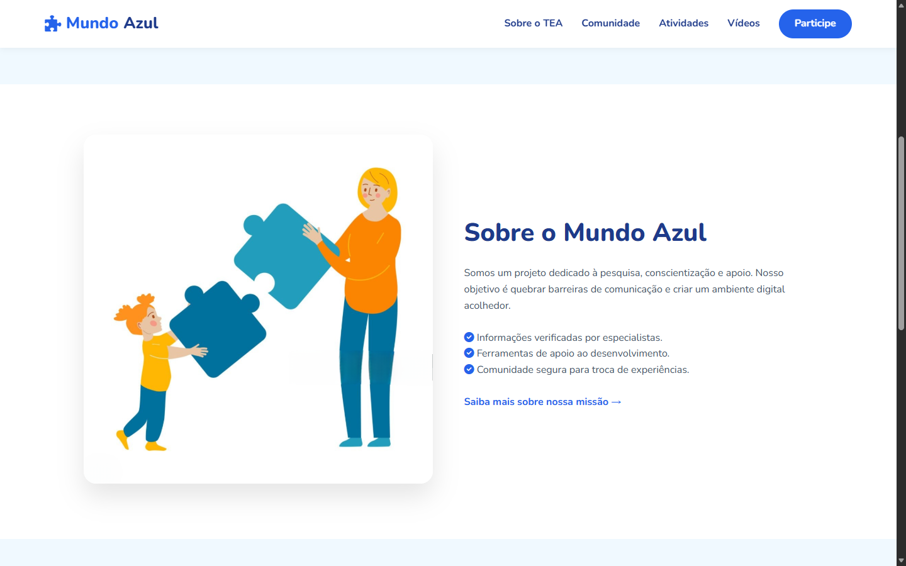
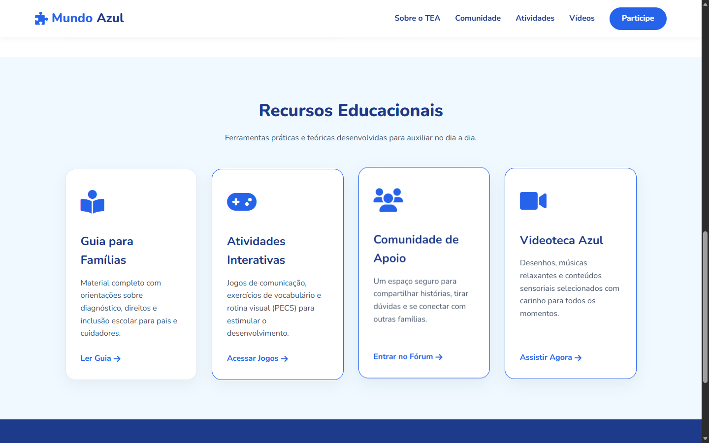
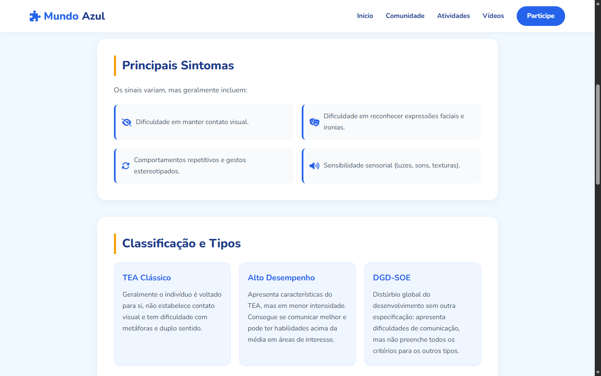
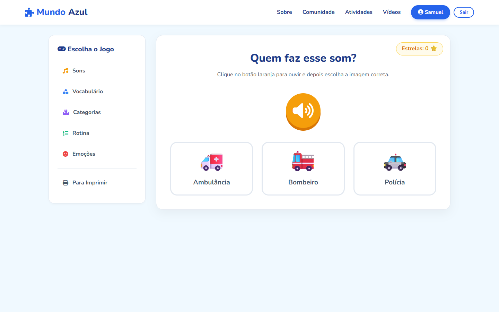
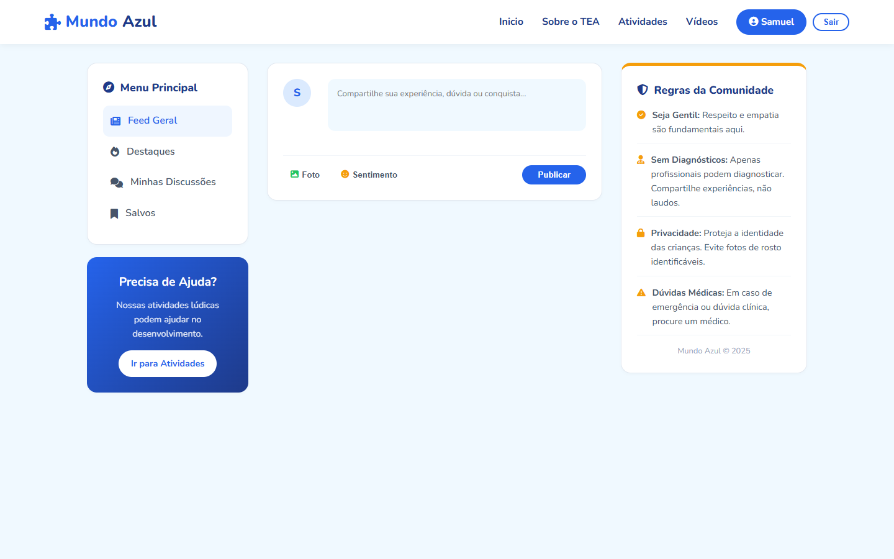
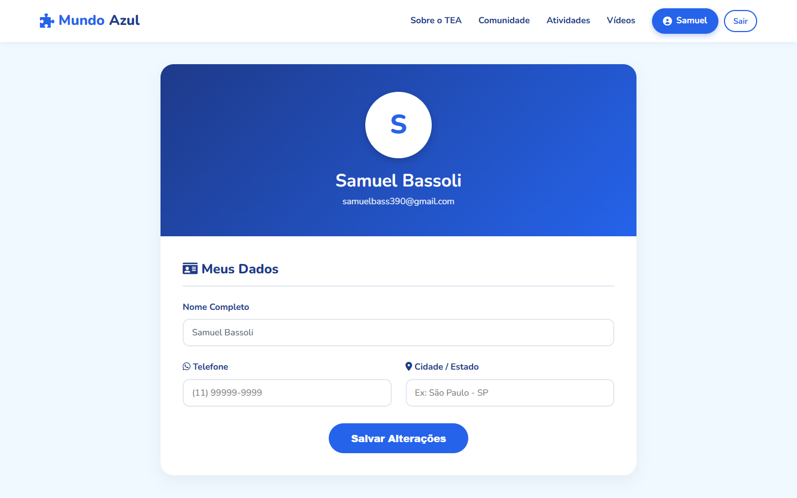

# 🧩 Mundo Azul - Plataforma de Apoio ao TEA

Trabalho de Conclusão de Curso (TCC) desenvolvido no curso de Desenvolvimento de Sistemas (Etec de Itaquera). A plataforma visa promover conscientização, pesquisa e apoio a indivíduos com Transtorno do Espectro Autista (TEA), familiares e educadores.

## 🚀 Tecnologias Utilizadas
* **Back-end:** PHP e Laravel.
* **Front-end:** HTML5, CSS3, JavaScript e Blade (Template Engine).
* **Banco de Dados:** MySQL (modelagem relacional para usuários, artigos e interações).
* **Ambiente de Desenvolvimento:** XAMPP/WAMP.

## 🌟 Funcionalidades
* **Acessibilidade Web:** Design inclusivo seguindo diretrizes de UX para usuários neurodivergentes (fontes sem serifa, controle de contraste e blocos de texto otimizados).
* **Blog Informativo:** Área para publicação de artigos e materiais educativos sobre o TEA.
* **Gestão de Usuários:** Cadastro seguro e formulários de contato interativos.
* **Design Responsivo:** Navegação fluida em dispositivos móveis, tablets e desktops.

## 📸 Telas do Sistema

### Página Inicial

### Painel de Acessibilidade

### Sobre o TEA

### Atividade Interativas

### Área do Blog e Artigos

### Catálogo de Vídeos

### Tela de Login

## 👨‍💻 Autores
Projeto desenvolvido em equipe multidisciplinar. Minha atuação principal envolveu a arquitetura de software, desenvolvimento da interface e integração de banco de dados.